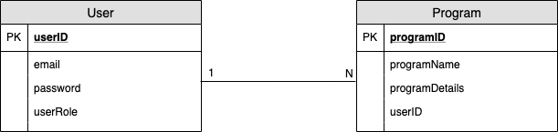
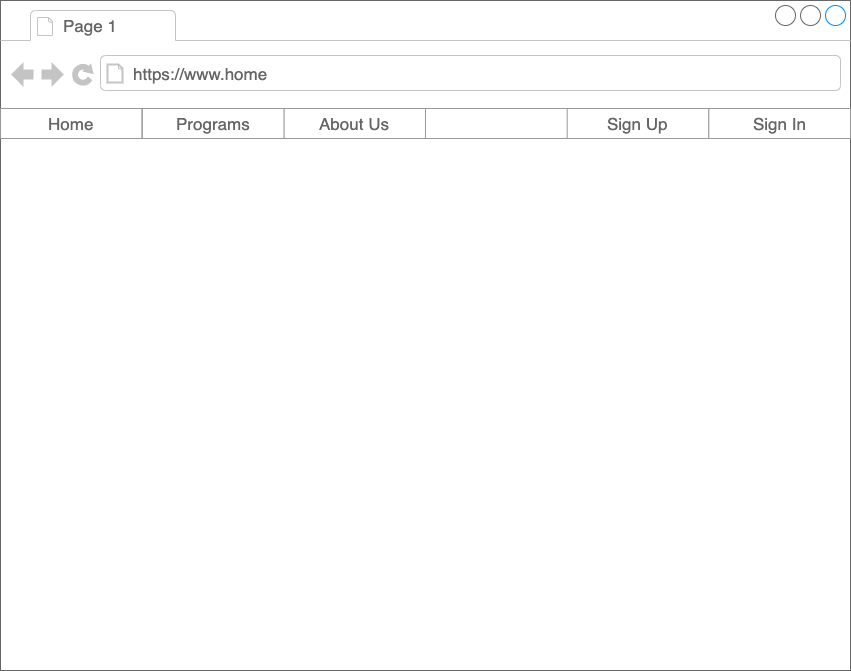
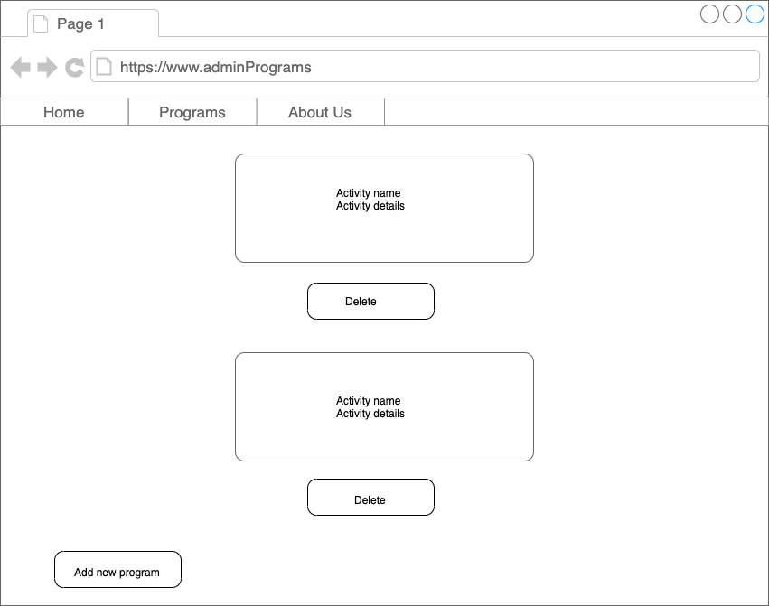

#  
#  Project #4: Shopping Website
## Table of Contents
- [User Story](#user-story)
- [Entity Relationship Diagram](#entity-relationship-diagram)
- [Wireframe](#wireframe)
- [Technologies](#Technologies-used)
- [Future Plan](#future-plan)
## User Story 
1. As an admin, I can SignUp/Sign in.
2. As an admin, I can View programs.
3. As an admin, I can Edit programs.
4. As an admin, I can Delete programs.

## Entity Relationship Diagram

## Wireframe



## Technologies used
* [React.js](https://react-cn.github.io/react/downloads.html)
* [Node.js](https://nodejs.org/en/download/)
* [Express.js ](https://expressjs.com/en/starter/installing.html)
* Templates: 
We used these two templates for authentication
```  
express:  https://github.com/sei-relativity/express-api-template
react: https://github.com/sei-relativity/react-template
```
## Future Plan
* Make the volunteer sign in and join a program